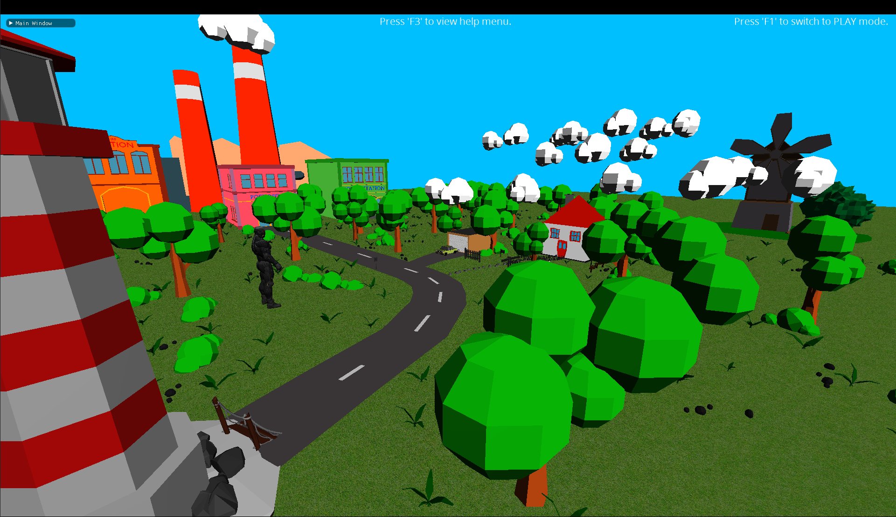

# DirectX 11 Framework

A framework create using DirectX 11 that allows for the simple creation of graphics by means of the system architecture and an entity-component system. 
*Created with reference to <a href="https://www.youtube.com/channel/UC5Lxe7GAsk_f8qMBsNmlOJg">Jpres</a>'s DirectX Programming Tutorials*

*Framework preview*

---

Credits:
        
        Source Code:
                    https://www.youtube.com/channel/UC5Lxe7GAsk_f8qMBsNmlOJg
                    https://www.youtube.com/playlist?list=PLcacUGyBsOIBlGyQQWzp6D1Xn6ZENx9Y2
                    
        Audio:
                    A Himitsu - Adventures: https://www.youtube.com/watch?v=8BXNwnxaVQE
