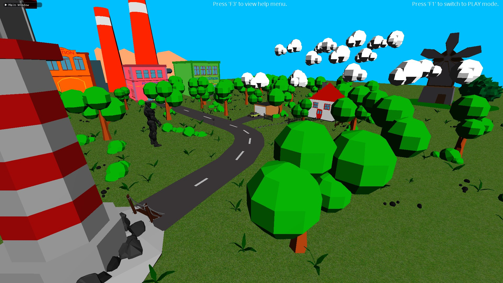

# Graphics Framework

&nbsp;

&nbsp;

A graphics framework created using DirectX 11 that allows for the simple creation of graphics by means of the system architecture and an entity-component system. 

<!-- *Created with reference to <a href="https://www.youtube.com/channel/UC5Lxe7GAsk_f8qMBsNmlOJg">Jpres</a>'s DirectX Programming Tutorials* -->
*- Click <a href="https://youtu.be/_9_MtRrjU20" target="_blank">here</a> to view on YouTube -*

## List of Features

- [x] Dynamic Point Lighting
- [x] Directional Lighting
- [x] Fog System
- [x] Stencil Masking
- [x] Mouse Picking
- [x] Stencil Outlining
- [x] Split-Screen
- [x] Camera System
- [x] Billboarding
- [x] Model Manipulation

## Getting Started

The graphics framework provides numerous tools for interacting with the graphics features that have been implemented. Refer to the following information on how to install and use the application.

### Dependencies
To use the framework, the following prerequisites must be met.
* Windows 10+
* Visual Studio
* Git Version Control

The framework relies on the following libraries and APIs to function.
* DirectX 11
* ImGui
* Assimp
* nlohmann json

### Installing

To download a copy of the framework, select "Download ZIP" from the main code repository page, or create a fork of the project. More information on forking a GitHub respository can be found [here](https://www.youtube.com/watch?v=XTolZqmZq6s).

### Executing program

As the project settings have been modified to support the addition of the aforementioned libraries and APIs, there are no additional steps required to execute the application.

## Appendices

https://user-images.githubusercontent.com/39779606/134824176-37ffb373-4a01-47cb-aa53-bca92df5b7dc.mp4

---

### Credits
        
        Code Reference
                https://www.youtube.com/channel/UC5Lxe7GAsk_f8qMBsNmlOJg
                https://www.youtube.com/playlist?list=PLcacUGyBsOIBlGyQQWzp6D1Xn6ZENx9Y2
                    
        Audio
                A Himitsu - Adventures: https://www.youtube.com/watch?v=8BXNwnxaVQE
